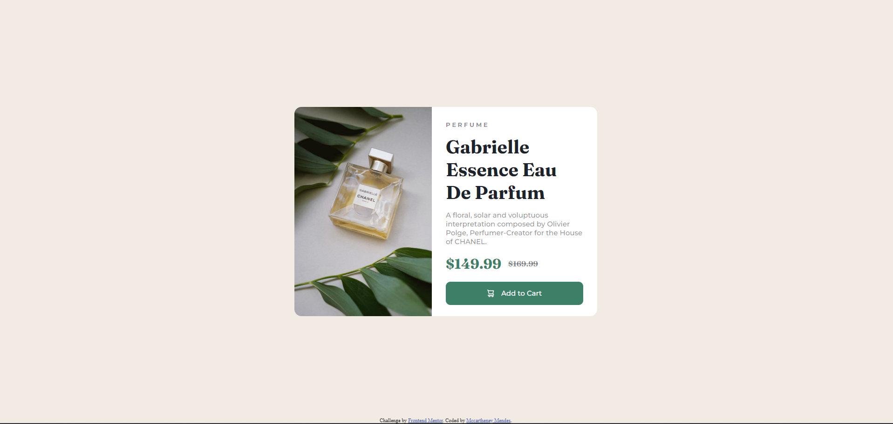

## Table of contents

- [Overview](#overview)
  - [The challenge](#the-challenge)
  - [Screenshot](#screenshot)
  - [Links](#links)
- [My process](#my-process)
  - [Built with](#built-with)
  - [What I learned](#what-i-learned)
- [Author](#author)

## Overview

### The challenge

Users should be able to:

- View the optimal layout depending on their device's screen size
- See hover and focus states for interactive elements

### Screenshot




### Links

- Solution URL: [solution URL](https://github.com/mccartheney/Product-preview-card-component)
- Live Site URL: [site URL](https://warm-taffy-4b8bb5.netlify.app/)

## My process

### Built with

- HTML5
- CSS 
- Flexbox
- Mobile-first workflow

### What I learned

In this challenge i found a obstacule. 
It was change the image by the width of the user screen and i learn whe can use the tag ```<picture>``` to change the image according the user sreen width.

```html
  <picture>
    <source media="(min-width: 1024px)" srcset="./images/image-product-desktop.jpg">
    
  </picture>
```

inside the `````` we put the default src and in each ```<source>``` we put the width and the another src the other image

## Author

- GitHub - [@mccartheney](https://github.com/mccartheney)
- LinkedIn - [@Mccartheney honofre](https://www.linkedin.com/in/mccartheney-honofre-892709292/)
